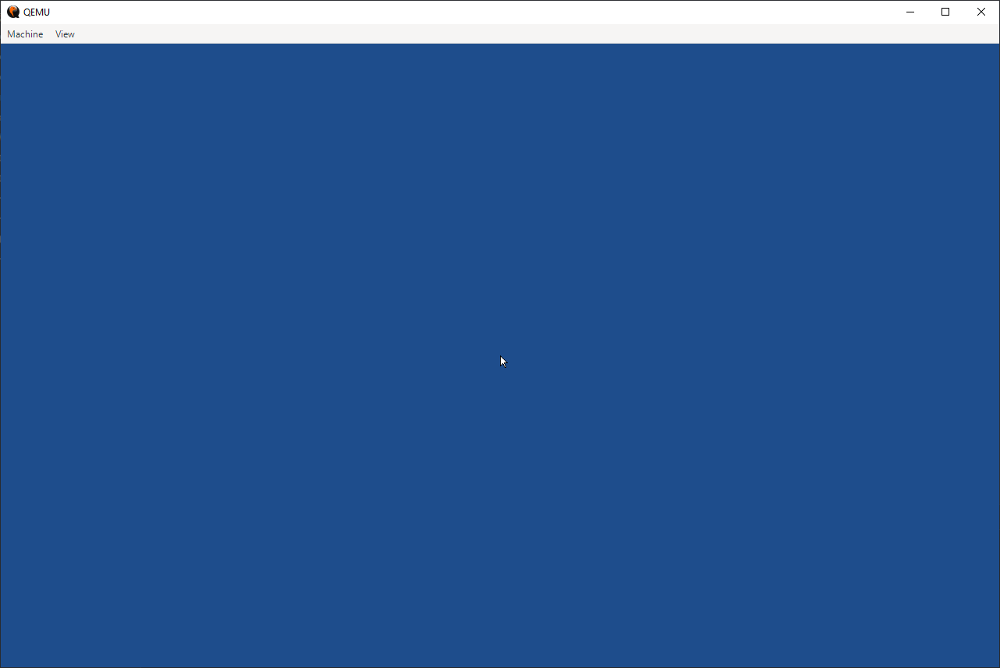
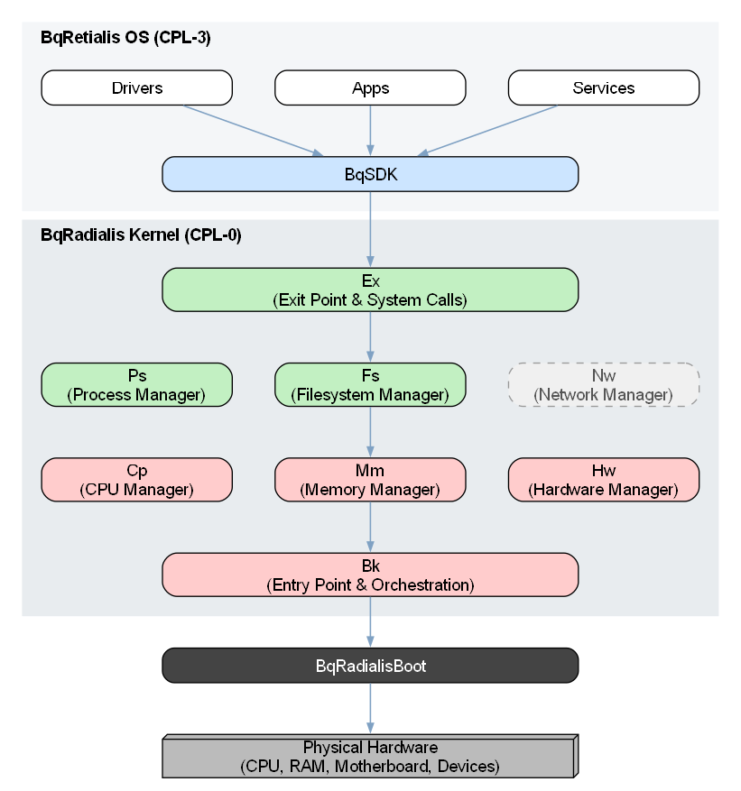

# BqRetialis

BqRetialis is a 64-bit x86-64 operating system powered by the BqRadialis kernel.

The architecture follows a monolithic stack. The diagram below shows the initialization order and the dependencies between the CPL-3 user space, CPL-0 kernel, and hardware.

The main focus of the project was the kernel itself. The rest of the stack, including the bootloader, drivers, and services, are just AI-generated placeholders which will be manually rewritten later.

The kernel still needs certain fixes and updates that I am not planning to be working on for a while. A few more AI-generated high-level modules, like a basic user space service or file explorer, might be added to the repository eventually just to provide some extra functionality in the meantime.
